# 🎨 Project Portfolio

A visual showcase of my personal projects in computer graphics, geometry, and simulation.

---

## 📐 Algorithmic Geometry

### 2D Point Cloud Mesher — Lawson-based Delaunay Builder
> An interactive Delaunay mesh generator for 2D point sets.

**Technologies:** `C++` `OpenGL` `ImGui` `Computational Geometry` 

---

#### What it does
- Builds a Delaunay triangulation from arbitrary 2D points using an iterative Lawson approach.
- Live insertion of points with mesh re-triangulation.

---

#### Live demos

  
   
  <em>Iterative vertex insertion with Delaunay constraints.</em>

<table align="center">
  <tr>
    <td align="center" width="50%">
      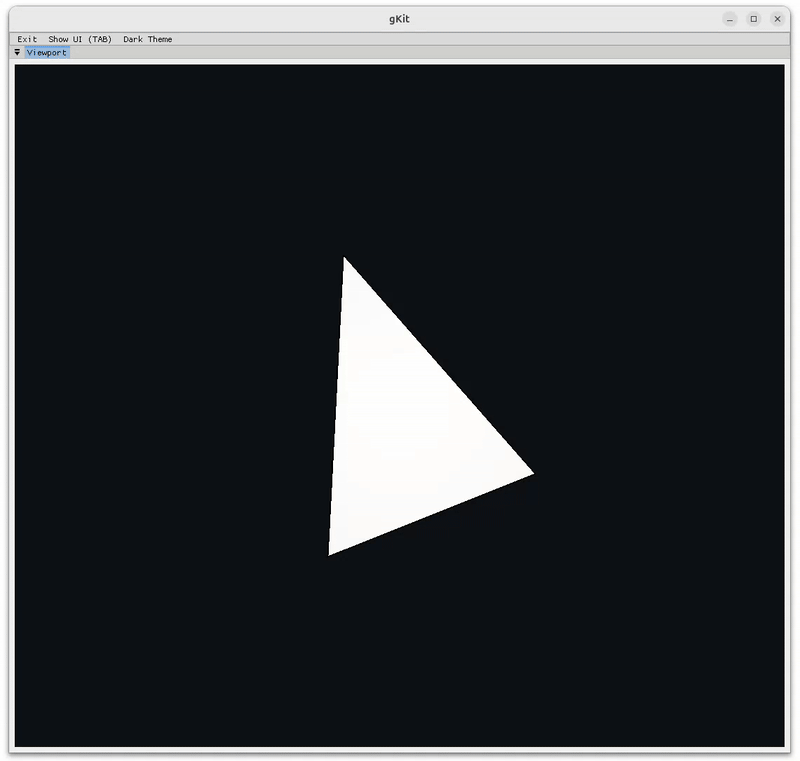
    </td>
    <td align="center" width="50%">
      <strong>Interactive insertion</strong>
        
      Drop points by hand; the triangulation updates continuously and preserves Delaunay and convexity criterion.
    </td>
  </tr>
</table>

[🔗 View Repository](https://github.com/tgrillon/LawsonMesher.git) | [📄 Technical Details](https://github.com/tgrillon/LawsonMesher/blob/main/README.md)

--- 

### Mesh Surface Generator
> Interactive 3D geometry construction from Bézier patches, revolution surfaces, and implicit fields

**Technologies:** `C++` `OpenGL` `ImGui` `Computational Geometry`

---

#### Overview
An interactive tool for generating 3D meshes from multiple geometric representations: parametric curves and surfaces, revolution profiles, and volumetric implicit fields. Features real-time editing with adjustable control point grids and resolution settings.

---

#### Revolution Surfaces

  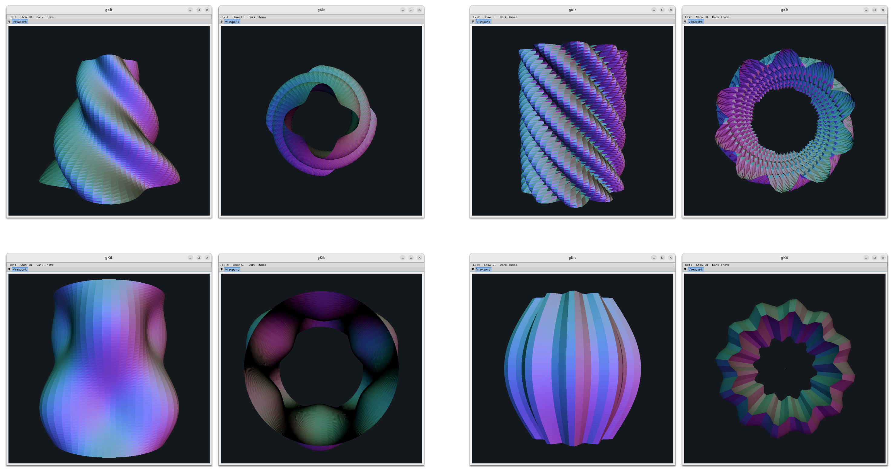
   
  <em>Surface generated by defining a radial function around a profile curve.</em>

**Features:**
- Custom profile Bézier curves 
- Parametric radial functions with angular and height variation
- Real-time preview with adjustable tessellation

---

#### Bézier Patch Modeling

  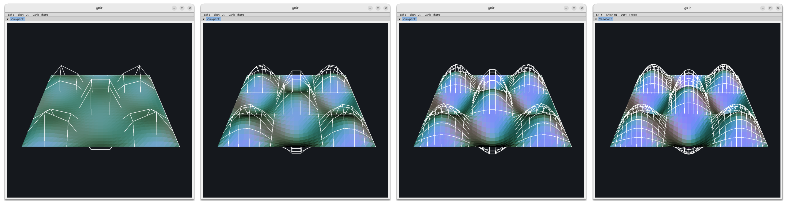
   
  <em>Interactive Bézier patches with adjustable control grid resolution (8×8, 16×16, 24×24, 31×31).</em>

**Capabilities:**
- Bicubic Bézier surface patches
- Parametric surface functions: `x(u,v)`, `y(u,v)`, `z(u,v)`
- Variable control point density for smooth or detailed surfaces

---

#### Bézier Spline Modeling

  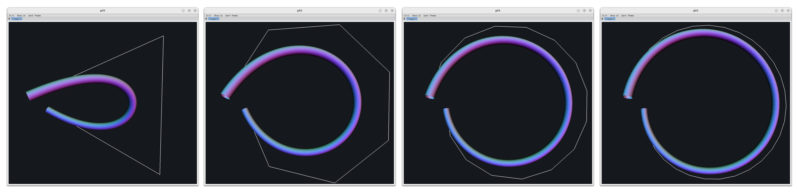
   
  <em>Curves generated from customizable spline profiles with adjustable control points (4, 8, 16, 31).</em>

**Spline Types:**
- Bézier curves with Bernstein polynomial basis
- Parametric curve functions: `x(t)`, `y(t)`, `z(t)`

---

#### Implicit Surfaces via Marching Cubes

  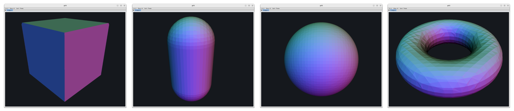
   
  <em>Mesh extraction from signed distance fields (SDF) using the marching cubes algorithm.</em>

**Implementation:**
- Custom SDF evaluation functions
- Support for CSG operations (union, intersection, difference)

[🔗 View Repository](https://github.com/tgrillon/ImplicitGeom.git)

---

## 🌟 Image Synthesis

### Ray Tracing
> Custom ray tracer on Shadertoy

  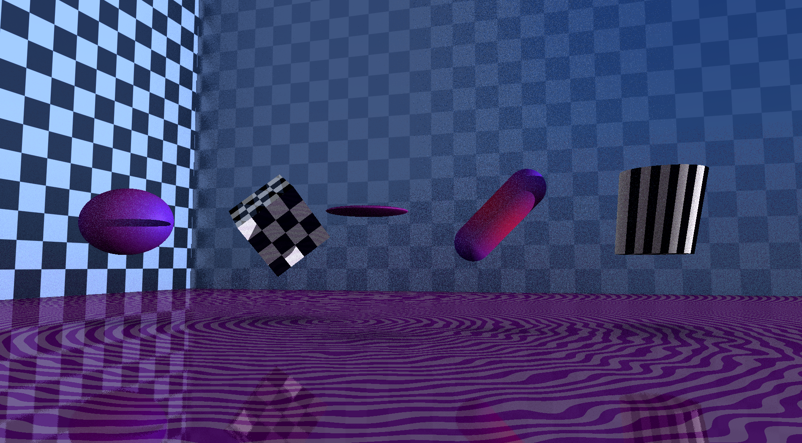
   
  <em>Ray tracing - geometric primitives, transformations and procedural textures.</em>

**Technologies:** `GLSL` `Shadertoy` `Real-time Rendering`

**Key Features:**

<table align="center">
  <tr>
    <td align="center" width="50%">
      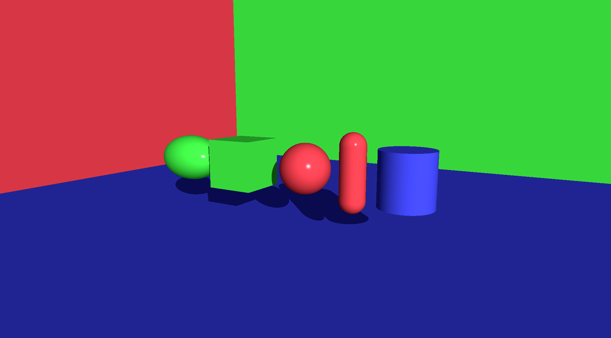
       
      <strong>Geometric Primitives</strong>
       
      <em>Spheres, boxes, ellipsoid, planes, capsule, cylinder</em>
    </td>
    <td align="center" width="50%">
      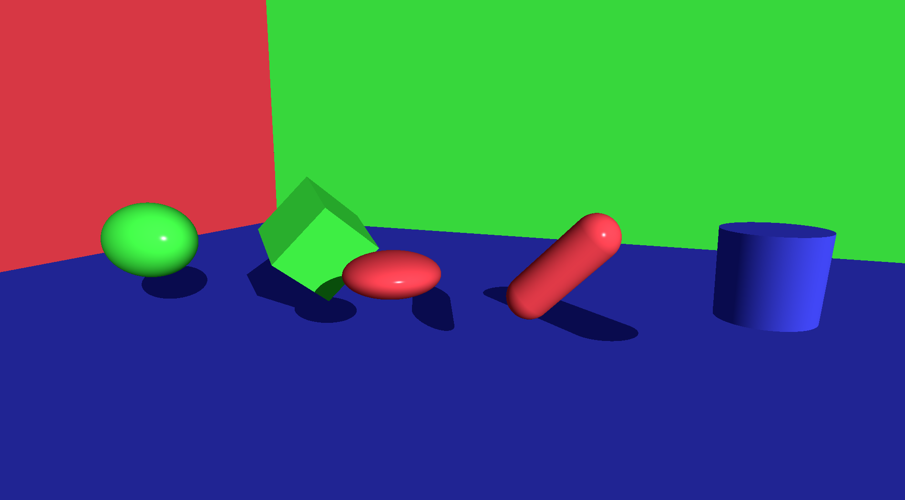
       
      <strong>Spatial Transformations</strong>
       
      <em>Translation, rotation, scaling, shearing</em>
    </td>
  </tr>
  <tr>
    <td align="center">
      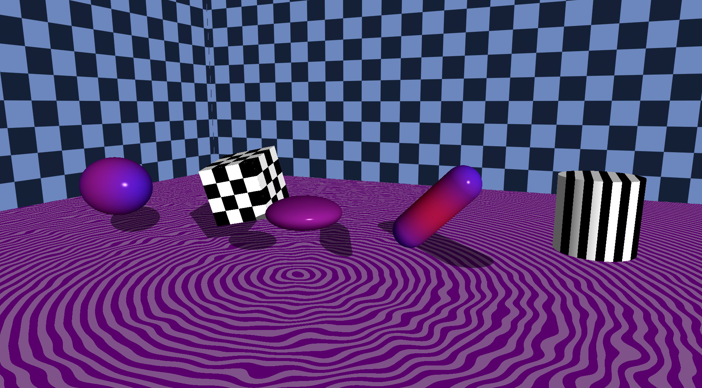
       
      <strong>Procedural Textures</strong>
       
      <em>Materials and surface patterns</em>
    </td>
    <td align="center">
      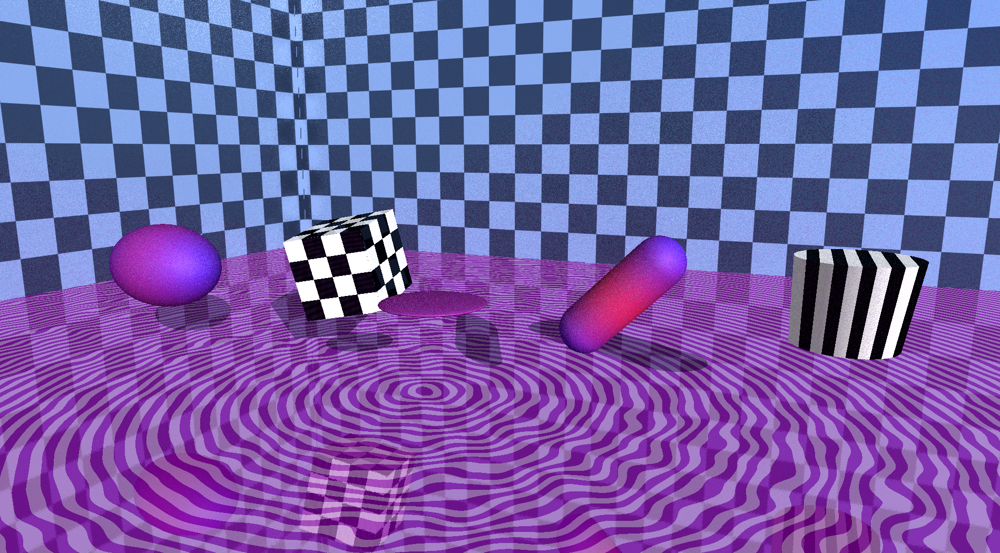
       
      <strong>Advanced Lighting</strong>
       
      <em>Reflections, ambient occlusion and shadows</em>
    </td>
  </tr>
</table>

[🔗 Live Demo on Shadertoy](https://shadertoy.com/view/DdVBWz)

---

## 🔍 Image Analysis & Processing

### Geometric Shape Detection - Hough Transform
> Automatic detection of lines and circles in images

<table align="center">
  <tr>
    <td align="center" width="50%">
      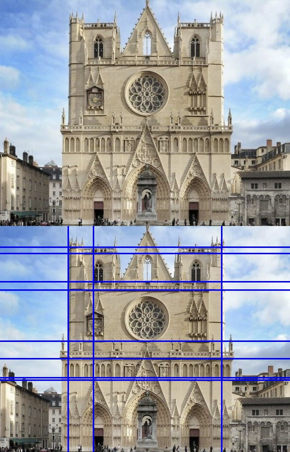
       
      <em>Line detection</em>
    </td>
    <td align="center" width="50%">
      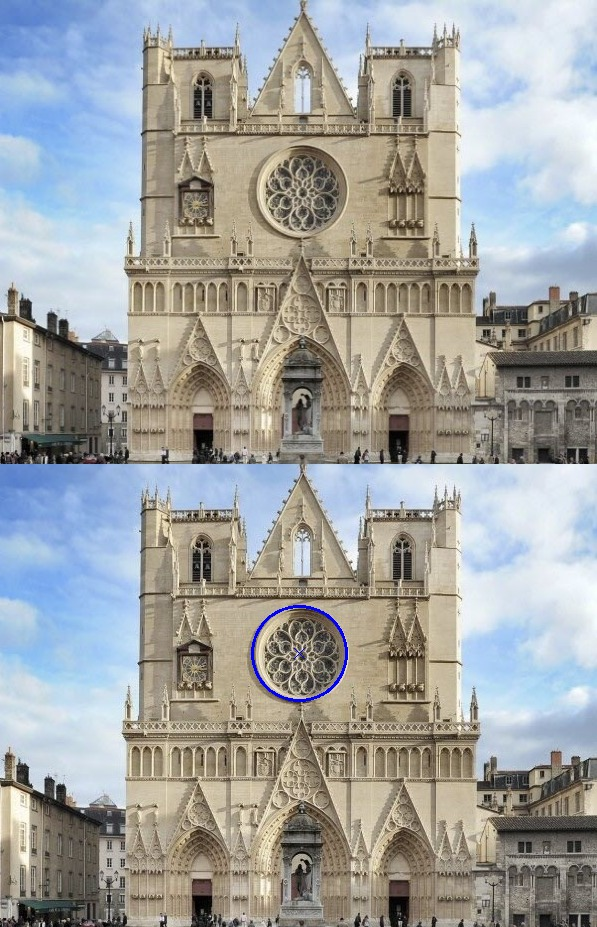
       
      <em>Circle detection</em>
    </td>
  </tr>
</table>

**Technologies:** `C++` `OpenCV` `Image processing`

**Features:**
- Line detection using classical Hough transform
- Circle detection with Hough variations

[📄 View report (in french)](data/houghTransform/rapport.pdf)

--- 

### Image Segmentation - Region Growing
> Segment images based on pixel similarity using region growing algorithm

<table align="center">
  <tr>
    <td align="center" width="33%">
      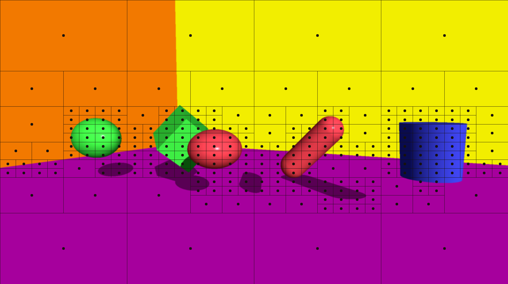
       
      <em>Seed Positioning</em>
    </td>
    <td align="center" width="33%">
      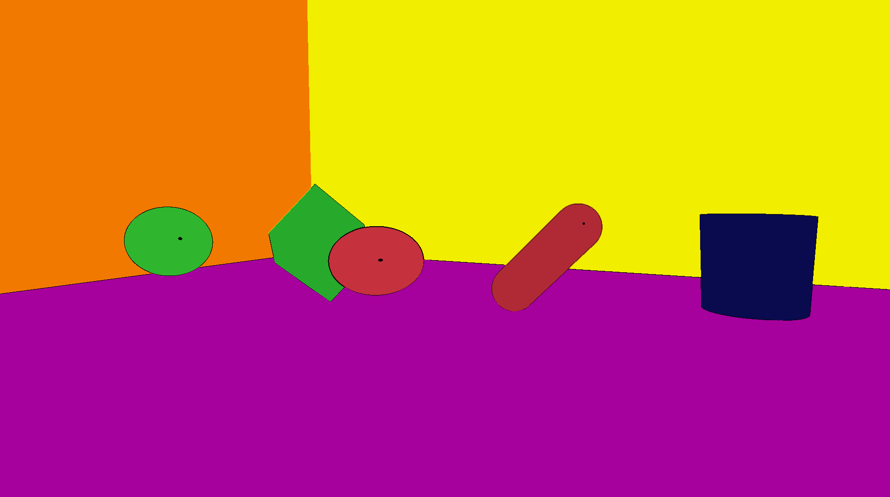
       
      <em>Region Segmentation</em>
    </td>
    <td align="center" width="33%">
      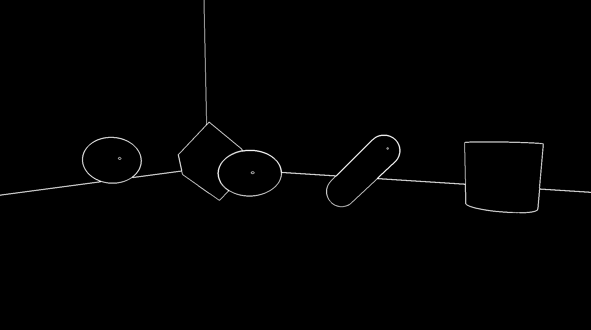
       
      <em>Region border</em>
    </td>
  </tr>
</table>

**Technologies:** `C++` `OpenCV` `Image Processing`

**Implementation:**
- Multi-seed region growing
- Adaptive threshold selection
- Connected component analysis

[📄 View report (in french)](data/regionGrowing/rapport.pdf)

---

## 🌊 Physics Simulation

### Fluid Simulation - SPH Method
> Real-time fluid dynamics using **S**moothed **P**article **H**ydrodynamics (**SPH**)

  

**Technologies:** `C++` `OpenGL` `Physics Simulation`

**Features:**
- Particle-based fluid simulation with 10k+ particles
- Pressure, viscosity, and surface tension forces
- Real-time rendering with optimized spatial hashing

---

### Cloth Simulation - Mass-Spring System
> Realistic fabric deformation using mass-spring dynamics

<table align="center">
  <tr>
    <td align="center">
      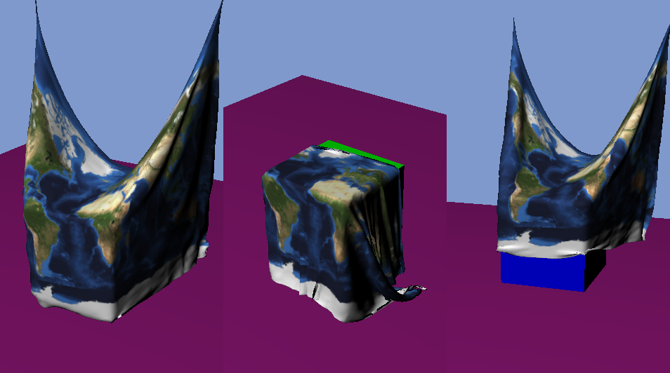
       
      <em>Mass-spring - box collision detection</em>
    </td>
  </tr>
  <tr>
    <td align="center">
      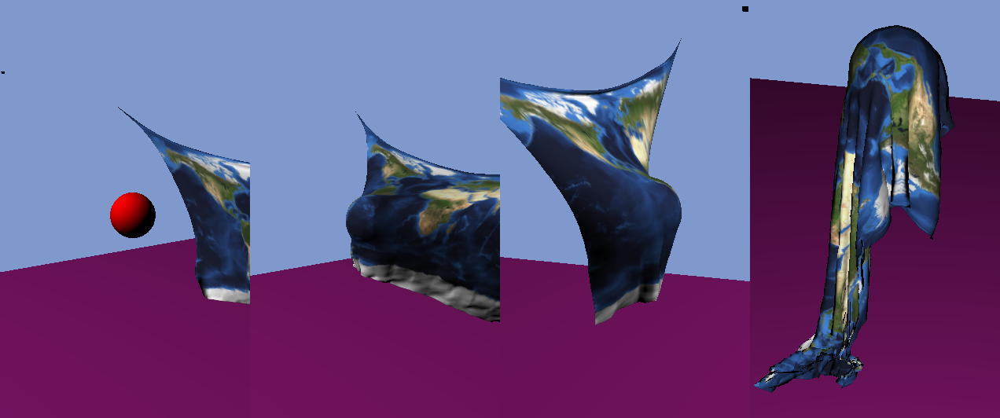
       
      <em>Mass-spring - sphere collision detection</em>
    </td>
  </tr>
</table>

**Technologies:** `C++` `Physics Engine` `Real-time Simulation`

**Physics:**
- Structural, shear, and bend springs
- Collision detection and response
- Wind forces and gravity

---

## 🔗 Links

- **Main Profile:** [github.com/tgrillon](https://github.com/tgrillon)
- **Contact:** [theogrillon6f9@gmail.com](mailto:theogrillon6f9@gmail.com)
- **LinkedIn:** [linkedin.com/in/théo-grillon](www.linkedin.com/in/théo-grillon-ab5169253)

---
